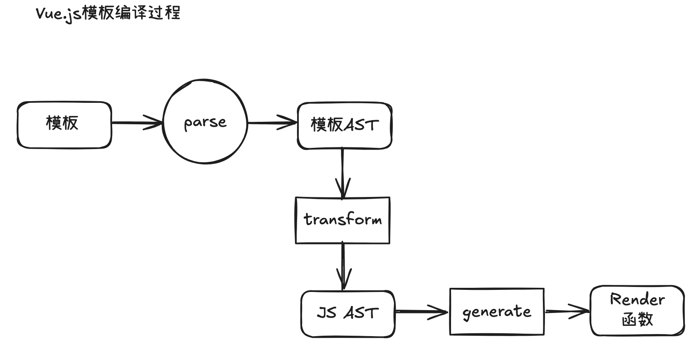

# 模板编译

整体过程：

1. 模板 => `模板 AST`
2. `模板 AST` => `JavaScript AST`
3. `JavaScript AST` => `render函数`



代码转换 AST 的在线工具：[astexplorer.net](https://astexplorer.net/)

## 模板 AST

```html
<div>
  <h1 v-if="ok">Vue Template</h1>
</div>
```

以上模板对应的模板 AST 如下，它结构上和 Vnode 类似，但是二者并不是一个东西，例如数据结构方面 type 的取值就有很大差异，使用场景也完全不同，不要混为一谈。

它也是树形的，和模板是同构的，使用 js 对象的方式描述的模板。

```javascript
const ast = {
  // 逻辑根节点
  type: 'Root',
  children: [
    // div 标签节点
    {
      type: 'Element',
      tag: 'div',
      children: [
        // h1 标签节点
        {
          type: 'Element',
          tag: 'h1',
          props: [
            // v-if 指令节点
            {
              type: 'Directive', // 类型为 Directive 代表指令
              name: 'if', // 指令名称为 if，不带有前缀 v-
              exp: {
                // 表达式节点
                type: 'Expression',
                content: 'ok',
              },
            },
          ],
        },
      ],
    },
  ],
};
```

### parse

这一步解析用到的函数是`parse`，它的主要功能是标记化`tokenized`，然后构造模板 AST。

### 标记化

标记化就是将模板，拆分成一个个的最小单元，方便于后续的 AST 构造。

```html
<div>Vue</div>
```

以上模板，将它们标记化后得到的标记（Token）是这样的：

```javascript
{ type: 'tag', name: 'div' }
{ type: 'text', content: 'Vue' }
{ type: 'tagEnd', name: 'div' }
```

这一步的实现使用到了**有限状态机**。

### AST 构造

使用 Token 构造模板 AST。因为是树形结构，所以要遍历 Token 列表，然后使用**栈**来构造（遇到开始标签入栈，遇到结束标签出栈）。
