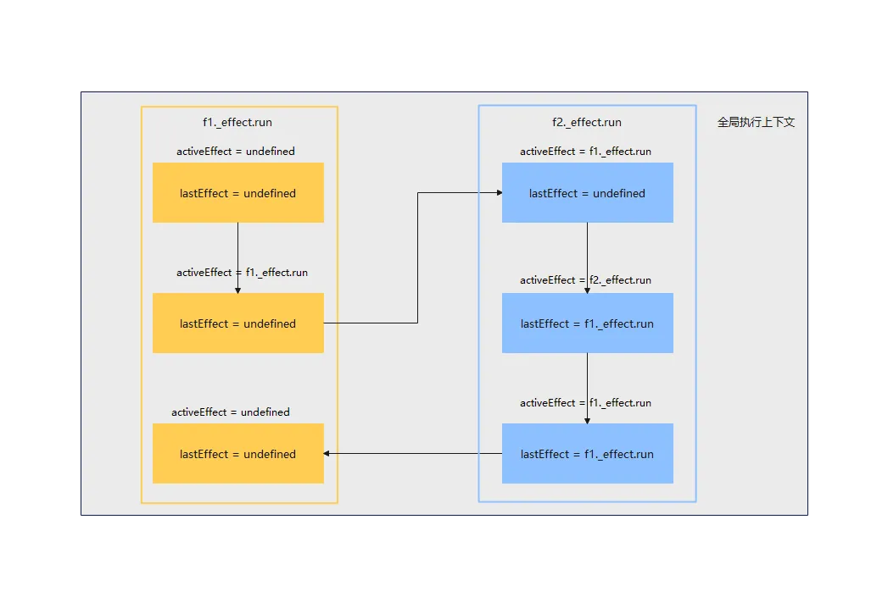
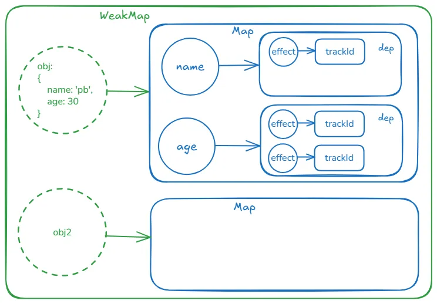

# effect

## API 介绍

**effect**，官方文档中没有，早期也没对外暴露，这个 api 的使用方法和`watchEffect`一致。

- `effect`第一个参数为函数，我们称其为`fn`
- `effect`函数调用完成，`fn`立即运行一次
- `fn`中用到的响应式数据发生了变化，`fn`再运行一次

```javascript
let obj = { name: 'pb', age: 30 };
let state = reactive(obj);
effect(() => {
  console.log(state.age);
});
setTimeout(() => {
  state.age++;
}, 1000);
```

## 实现要点

### ReactiveEffect 类

### effect 嵌套调用

```javascript
effect(() => {
  console.log('f1 ', state.name);

  effect(() => {
    console.log('f2 ', state.name);
  });

  console.log(state.age);
});
```

问题：不做处理的情况下，运行至`console.log(state.age);`这一行，其对应的活跃 effect（activeEffect）是`f2._effect`，是不对的，出现依赖搜集错误。

解决：
利用 js**执行上下文栈**特性，`activeEffect`在全局执行上下文中;
每次`_effect.run`，创建新的执行上下文栈，栈内的`lastEffect`存储`activeEffect`;
修改`activeEffect`为当前`effect`,`fn`运行完之后再使用`lastEffect`保存的重置。

一个全局变量`activeEffect`来保存当前正在运行的 `fn` 所对应的 effect(`ReactiveEffect`实例)

```bash
f1 effect运行
lastEffect = undefined, activeEffect = f1.effect
f1.fn()
    // log: f1 pb
    遇到f2 effect 运行
    lastEffect = f1.effect, activeEffect = f2.effect
    f2.fn()
      // log: f2 pb
    f2.fn运行结束，activeEffect = f1.effect
    // log: 30
    f1.fn运行结束，activeEffect = undefined
```



## 依赖

数据结构：`WeakMap` + `Map`。

- 创建了应用内唯一的`WeakMap`存储依赖关系，依赖关系是树状的（根节点 WeakMap，第 1 层节点响应式对象，第 2 层响应式对象的各个属性，第 3 层...）
- 第 1 层：响应式对象本身作为键值，创建一个 Map 作为值，放入 WeakMap。
- 第 2 层：类型是 Map，对象属性作为键值，dep 作为值（dep 也是一个 Map）。
- 第 3 层：类型是 Map，引用了属性的 effect 作为键值，effect 的 trackId 作为值。（低版本中是Set，为了方便清理改为了Map）




## 依赖清理

也可以叫“依赖重建”

问题：effect.fn中有条件语句，且不同分支中引用的响应式对象属性不同，然后修改属性条件判断发生变化，这种情况如果不做处理，可能会造成依赖冗余，进而出现非预期的表现（非依赖的变量修改后`effect.fn`运行）。

示例：
```javascript
// 依赖清理示例
    let obj = { name: 'pb', age: 30, flag: true };
    let state = reactive(obj);
    effect(() => {
      console.log('effect.fn runner'); // 打印3次
      app.innerHTML = state.flag ? state.name: state.age;
    });
    // 依赖数据结构：{ obj: { flag: {effect}, name: {effect} } }
    setTimeout(() => {
      state.flag = false;

      setTimeout(() => {
        console.log('修改属性后， 不应该触发 effect 重新执行了')
        state.name = 'handsome pb';
      }, 1000); 
      // 更新name，依赖数据中仍然有name，所以effect.fn会运行，这样不合理，因为effect.fn中都没再使用name了，此次运行没有没有意义
    }, 1000);
    // state.flag 变化后，effect.fn运行，dep数据结构更新
    // 依赖数据结构：{ obj: { flag: {effect}, name: {effect}, age: {effect} } }
    // 问题：name不需要依赖收集了，因为不再被使用了
    // 依赖数据结构需要变为：{ obj: { flag: {effect}, age: {effect} } }
```
解决：
  0. 清理什么？不再被依赖的属性的dep和effect的关联关系。
  1. 依赖需要重建，重建操作需要在哪个环节开始呢？`effect.fn`重新（声明后先运行了一次，创建了依赖关系）运行前，运行过程中`Proxy.get` => `track` => `trackEffect`会再次走创建依赖流程。
  这里具体的重建前置操作就是：“将effect.deps的数组长度即`effect._depsLength`重置为`0`”。
  2. 清理的实现，我们要解决的问题是同个effect（ActiveEffect实例）上依赖的属性发生了变化，这些属性对应的就是`effect.deps`，我们需要把不再用到的属性的dep移除，`effect.deps`数组更新。更新的策略（**diff算法**）：是从头开始比对，每次trackEffect中接收一个属性的dep和数组中按照索引升序取到的旧的dep做比对，
      * 如果一致，说明当前属性在两次effect.fn中都有使用到，依赖关系不做修改，`effect._depsLength`自增用于下次比对
      * 如果不一致，说明旧的dep对应的属性不再被当前effect使用了，需要双向清理（依赖关系是双向的，清理重建也是双向的）
        - 新的dep赋值给deps数组当前比对的位置覆盖旧的dep，`effect.deps[effect._depsLength++] = dep;`
        - 旧的dep删除掉effect，`oldDep.delete(effect)`
      * 补丁：以上算法从头开始逐个比较`effect.deps`数组中的dep，如果新的fn中dep（被应用的属性）比旧的fn中少，那么会出现，deps数组中超出新的dep数量的dep无法被清理的问题。创建一个后置的专门清理的函数`postCleanEffect`来解决这个问题，这个后置的清理中就会体现出明明有`effect.deps.length`可以代表数组长度，还要维护`_depsLength`这个变量的原因，`_depsLength`在清理环节标记清理到的位置。

## 依赖重复收集

问题：一个effect.fn中多次引用了同个属性，造成依赖关系重复添加（dep中set了同个effect(`ReactiveEffect`实例)多次）

示例：
```javascript
// 依赖重复收集示例
    let obj = { name: 'pb', age: 30, flag: true };
    let state = reactive(obj);
    effect(() => {
      app.innerHTML = state.flag + ','+ state.flag + ','+state.flag;
    });
    // 问题：state.flag 被引用了3次，相应的也会进行3次依赖收集
    // dep.set(effect, ) // 这个添加是没问题的，因为数据结构式Map，key值相同，进行set不会添加新条目
    // 双向依赖另外一个方向就会有问题，effect.deps 添加 dep，会造成effect实例上重复添加相同属性的dep
```

解决：

* 在effect实例上添加一个ID属性`_trackId`，每次`effect.fn`运行前，`_trackId`自增（也就是每次fn运行时，_trackId都不同）
* dep中effect是作为键，`effect._trackId`作为值
* `trackEffect`函数中添加依赖关系前检查，通过dep中取出上次的`dep.get(effect)`与当前的`effect._trackId`对比
  - 如果不一致，则说明不是同一次fn运行，重新收集依赖是合理的（fn中可能有分支逻辑导致引用的属性不不一致）
  - 如果一致，则说明是同一次fn运行，之前收集过不再收集

`scheduler` => `effect.run` => `effect._trackId++` => `effect.fn` => `Proxy.get` => `track` => `trackEffect`

我们跟踪推导下：
1. 声明后，调度器`scheduler`立即运行一次 =>`effect.run`=> `effect.fn` => `_trackId++`，假设自增后为1 => `effect.fn`运行 => 第1次使用到`state.flag`触发`Proxy.get` => `track` => `trackEffect`。条件判断，新旧_trackId不同，但是旧的dep不存在，直接添加双向依赖
2. `effect.fn`还没运行结束，继续运行，第2次使用到`state.flag`，触发`Proxy.get` => `track` => `trackEffect`。条件判断，旧的`dep.get(effect)`、新的`effect._trackId`值都是`1`，说明该属性和effect的依赖关系已经收集过了，不再收集。
3. 再别处修改了`state.flag`，触发`Proxy.set` => `trigger` => `triggerEffects` => 调度器`scheduler`运行 => `effect.run` => 重点：`_trackId++` => `effect.fn` => `Proxy.get` => `track` => `trackEffect`。条件判断，旧的`dep.get(effect) = 1`、新的`effect._trackId = 2`，二者不相等，重新进行依赖收集，符合预期。